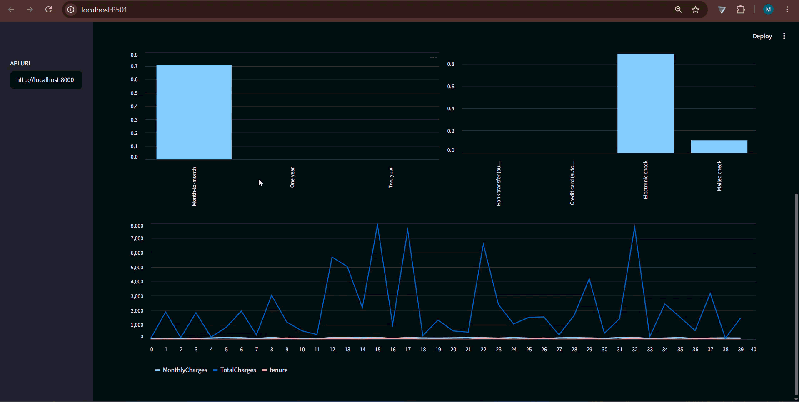
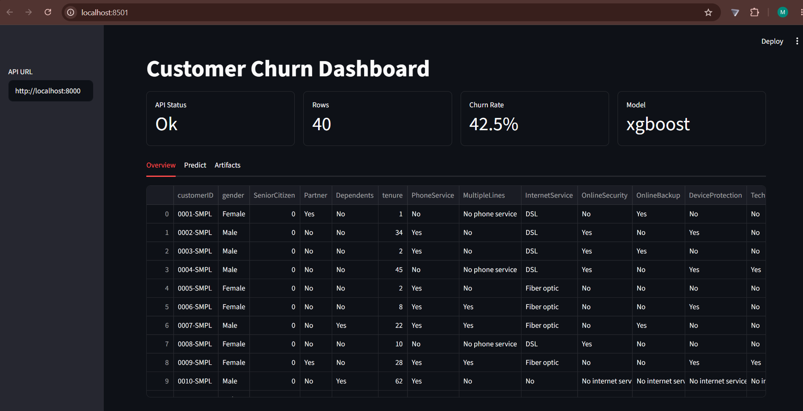
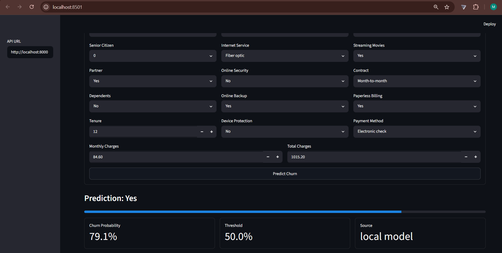
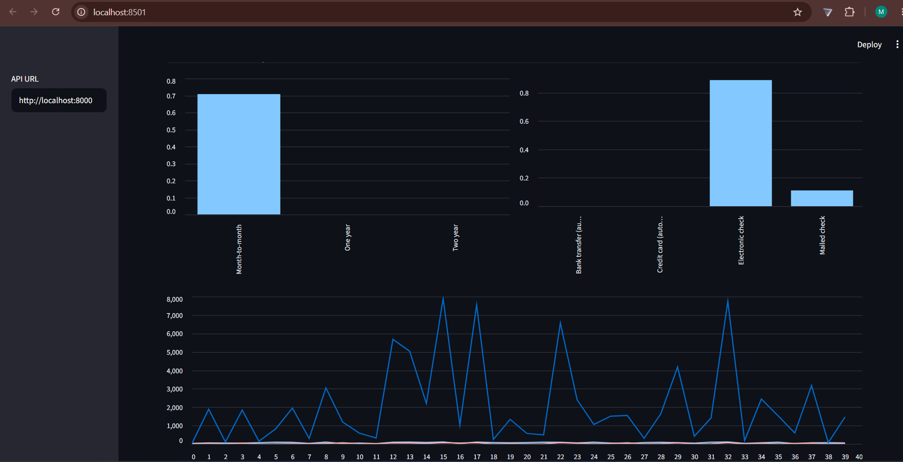
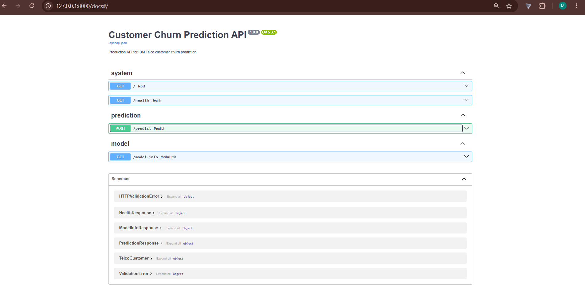
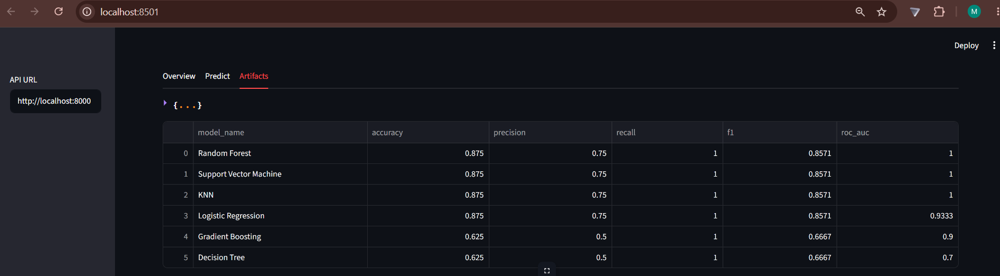
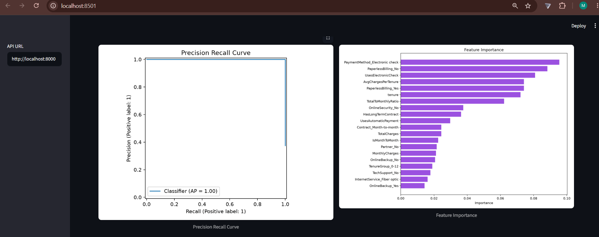
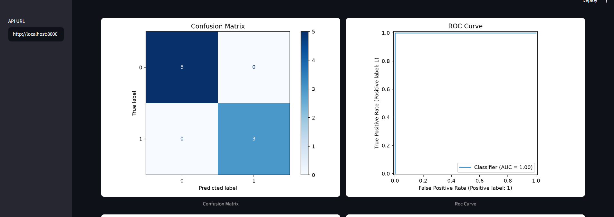

<div align="center">

# 📉 Customer Churn Prediction

**An end-to-end machine learning system that predicts telecom customer churn — from automated multi-model training to a production REST API and an interactive analytics dashboard.**

[](https://www.python.org/)
[](https://scikit-learn.org/)
[](https://fastapi.tiangolo.com/)
[](https://streamlit.io/)
[](https://optuna.org/)
[](https://www.docker.com/)
[](.github/workflows/ci.yml)
[](https://docs.astral.sh/ruff/)
[](#-license)



&nbsp;

[**🚀 Live Demo**](#) &nbsp;•&nbsp; [**📖 API Docs**](#-rest-api) &nbsp;•&nbsp; [**🖥️ Dashboard**](#-dashboard)

<sub>The <b>Live Demo</b> link is a placeholder — update it once the service is deployed.</sub>

</div>

---

## 📑 Table of Contents

- [Overview](#-overview)
- [Features](#-features)
- [Architecture](#-architecture)
- [Folder Structure](#-folder-structure)
- [Technology Stack](#-technology-stack)
- [Machine Learning Pipeline](#-machine-learning-pipeline)
- [Dashboard](#-dashboard)
- [REST API](#-rest-api)
- [Installation](#-installation)
- [Screenshots](#-screenshots)
- [Model Performance](#-model-performance)
- [Testing](#-testing)
- [Docker](#-docker)
- [Deployment](#-deployment)
- [Environment Variables](#-environment-variables)
- [Future Improvements](#-future-improvements)
- [Contributing](#-contributing)
- [License](#-license)
- [Author](#-author)

---

## 🔎 Overview

**Customer Churn Prediction** is a production-grade machine learning service built around the
IBM Telco Customer Churn dataset. It trains and compares multiple classifiers, tunes the best
one with Optuna, and serves predictions through a typed FastAPI service and a Streamlit
dashboard.

The repository is designed as a complete, reproducible ML project: a modular `src/` training
pipeline, persisted model artifacts, automatically generated evaluation and explainability
reports, a containerized two-service deployment, and a GitHub Actions pipeline that lints,
tests, trains, and smoke-tests predictions on every push.

---

## ✨ Features

Every feature below maps directly to code in this repository — nothing is aspirational.

#### Machine Learning
- **Multi-model training & automatic selection** — Logistic Regression, Random Forest, Gradient
  Boosting, SVM, Decision Tree, and KNN are trained and ranked, with the best model chosen by
  ROC-AUC.
- **Optional gradient-boosting models** — XGBoost, LightGBM, and CatBoost are registered
  automatically when installed and skipped gracefully when not.
- **Hyperparameter tuning with Optuna** — TPE sampler with stratified k-fold cross-validation;
  the study is persisted to disk.
- **Domain feature engineering** — charge ratios, tenure buckets, service-adoption counts, and
  contract/payment behavior flags via a custom scikit-learn transformer.
- **Unified scikit-learn pipeline** — feature engineering → imputation → scaling → one-hot
  encoding → estimator, serialized as a single artifact.
- **Evaluation artifacts** — metrics JSON, classification report, confusion matrix, ROC curve,
  precision–recall curve, and feature-importance plot.
- **Exploratory data analysis** — class-balance, distribution, churn-rate, and correlation
  figures generated at training time.
- **SHAP explainability** — summary, dependence, and waterfall plots plus per-feature importance
  (optional, toggleable).
- **Experiment tracking** — optional MLflow logging of params, metrics, and artifacts.
- **Reproducibility** — global seeding and deterministic, stratified train/validation/test splits.

#### Serving & Application
- **Typed REST API** — FastAPI with Pydantic v2 request/response validation and OpenAPI docs.
- **Startup model warm-up** — a lifespan handler caches the model so the first request avoids
  cold-load latency; the service still starts if no model exists yet.
- **Interactive dashboard** — Streamlit app with Overview, Predict, and Artifacts tabs.
- **Resilient prediction** — the dashboard calls the API and transparently falls back to the
  local model artifact when the API is unreachable.
- **Model persistence & metadata** — joblib artifact plus a JSON model card describing metrics,
  threshold, and feature set.

#### Engineering & Operations
- **Containerized deployment** — Docker image and a Docker Compose stack running API + dashboard.
- **Continuous integration** — GitHub Actions runs Ruff lint, Ruff format check, the Pytest
  suite, a sample training run, and a prediction smoke test.
- **Centralized configuration** — all paths, hyperparameters, and ports are configurable via
  environment variables.
- **Structured logging** — consistent console and file logging across training, API, and CLI.

---

## 🏗 Architecture

```text
                ┌──────────────────────────────────────────────────┐
                │                    Data Layer                    │
                │        data/raw  ──►  data/processed (clean)      │
                └────────────────────────┬─────────────────────────┘
                                         │
                                         ▼
        ┌──────────────────────────────────────────────────────────────┐
        │                   Training Pipeline  (src/)                    │
        │                                                                │
        │   clean ─► feature engineering ─► preprocessing ─► model       │
        │           selection (6+ models) ─► Optuna tuning ─► evaluate    │
        └───────────────┬──────────────────────────────┬─────────────────┘
                        │ persists                      │ writes
                        ▼                               ▼
        ┌───────────────────────────┐       ┌───────────────────────────┐
        │          models/          │       │          reports/         │
        │     churn_model.joblib    │       │   metrics · figures · SHAP │
        │      model_info.json      │       │     model_comparison.csv   │
        └─────────────┬─────────────┘       └─────────────┬─────────────┘
                      │ loads                              │ reads
                      ▼                                    ▼
        ┌───────────────────────────┐  HTTP   ┌───────────────────────────┐
        │       FastAPI  (api/)     │◄────────┤  Streamlit  (dashboard/)  │
        │   /  /health  /predict    │         │  Overview · Predict ·     │
        │     /model-info  /docs    ├────────►│  Artifacts  (API +        │
        │                           │         │  local-model fallback)    │
        └─────────────┬─────────────┘         └───────────────────────────┘
                      │
                      ▼
              End users / clients
```

---

## 📁 Folder Structure

```text
customer-churn-prediction/
├── api/                          # FastAPI service
│   ├── main.py                   # App factory, CORS, model warm-up lifespan
│   ├── routes.py                 # Endpoints: /, /health, /predict, /model-info
│   └── schemas.py                # Pydantic request/response models
├── dashboard/                    # Streamlit application
│   ├── app.py                    # UI: Overview / Predict / Artifacts tabs
│   └── service.py                # Testable, framework-free dashboard helpers
├── src/                          # Core ML library
│   ├── config.py                 # Centralized, env-driven settings
│   ├── logger.py                 # Logging configuration
│   ├── utils.py                  # Data, artifact, and reproducibility helpers
│   ├── preprocessing.py          # Cleaning + dataframe preprocessing transformer
│   ├── feature_engineering.py    # Domain feature transformer
│   ├── pipeline.py               # scikit-learn pipeline construction
│   ├── model_selection.py        # Model registry + automatic selection
│   ├── hyperparameter_tuning.py  # Optuna optimization
│   ├── evaluate.py               # Metrics, EDA figures, SHAP artifacts
│   ├── predict.py                # Cached inference utilities
│   └── train.py                  # Training entry point (CLI)
├── tests/                        # Pytest suite
├── data/
│   ├── raw/                      # Source CSVs (bundled sample included)
│   └── processed/                # Generated cleaned dataset
├── models/                       # Generated model artifact + metadata
├── reports/                      # Generated metrics, figures, comparison
├── assets/                       # README images and screenshots
├── Dockerfile                    # Container image
├── docker-compose.yml            # API + dashboard stack
├── requirements.txt              # Runtime dependencies
├── requirements-dev.txt          # Development/tooling dependencies
├── pyproject.toml                # Ruff lint/format configuration
└── .env.example                  # Example configuration
```

---

## 🧰 Technology Stack

| Category              | Technologies                                                        |
| --------------------- | ------------------------------------------------------------------- |
| **Language**          | Python 3.12                                                         |
| **ML & Data**         | scikit-learn, pandas, NumPy                                          |
| **Boosting (opt.)**   | XGBoost, LightGBM, CatBoost                                          |
| **Tuning & Tracking** | Optuna, MLflow                                                       |
| **Explainability**    | SHAP                                                                 |
| **Visualization**     | Matplotlib                                                          |
| **API**               | FastAPI, Uvicorn, Pydantic v2                                        |
| **Dashboard**         | Streamlit                                                            |
| **Persistence**       | joblib                                                               |
| **Testing**           | Pytest, HTTPX                                                        |
| **Quality**           | Ruff (lint + format)                                                 |
| **Packaging / Ops**   | Docker, Docker Compose, GitHub Actions                              |

---

## 🤖 Machine Learning Pipeline

<details open>
<summary><b>End-to-end flow</b></summary>

### 1. Dataset
The IBM Telco Customer Churn dataset (~7,000 customers, 21 columns). The loader uses
`data/raw/WA_Fn-UseC_-Telco-Customer-Churn.csv` when present and falls back to the bundled
`data/raw/sample_telco_churn.csv` for fast local smoke tests. The target column is `Churn`.

### 2. Preprocessing
`clean_telco_data` removes duplicates, trims string columns, coerces `TotalCharges`,
`MonthlyCharges`, and `tenure` to numeric (treating blanks as missing), and maps the `Churn`
target to `0/1`. A `DataFramePreprocessor` then applies median imputation + standard scaling to
numeric features and most-frequent imputation + one-hot encoding to categorical features.

### 3. Feature Engineering
`CustomerChurnFeatureEngineer` derives domain features, including:
- **Charges:** `AvgChargesPerTenure`, `TotalToMonthlyRatio`, `HighMonthlyCharges`
- **Tenure:** `TenureGroup`, `IsNewCustomer`, `IsLongTermCustomer`
- **Services:** `ServiceCount`, `HasAnyProtection`, `HasStreaming`, `HasInternetService`
- **Contract / Payment:** `IsMonthToMonth`, `HasLongTermContract`, `UsesElectronicCheck`,
  `UsesAutomaticPayment`

### 4. Model Training
The data is split into stratified train/validation/test sets. Every model in the registry is
trained and evaluated on the validation set, producing a ranked `model_comparison.csv`. The
candidate registry includes Logistic Regression, Random Forest, Gradient Boosting, SVM, Decision
Tree, and KNN, plus XGBoost, LightGBM, and CatBoost when those libraries are installed.

### 5. Evaluation
The best model is chosen by ROC-AUC and evaluated on the held-out test set. Accuracy, precision,
recall, F1, and ROC-AUC are written to `reports/metrics.json`, alongside a confusion matrix, ROC
curve, precision–recall curve, classification report, and feature-importance plot. Optional SHAP
artifacts add summary, dependence, and waterfall explanations.

### 6. Prediction
`predict_churn` loads the cached artifact, applies the full pipeline, and returns a label,
churn probability, and decision threshold for one or many records. The model is cached in-process
via `lru_cache`.

### 7. Persistence
Training writes a single joblib artifact (`models/churn_model.joblib`) containing the fitted
pipeline and metadata, plus a human-readable model card (`models/model_info.json`) with metrics,
threshold, feature names, and tuning parameters.

</details>

---

## 🖥 Dashboard

The Streamlit dashboard (`dashboard/app.py`) opens with header metrics — API status, row count,
churn rate, and active model — and is organized into three tabs.

| Tab           | Purpose                                                                                          |
| ------------- | ------------------------------------------------------------------------------------------------ |
| **Overview**  | Previews the dataset and visualizes churn rate by contract and payment method, plus charge and tenure trends. |
| **Predict**   | A full customer input form that requests a prediction from the API and falls back to the local model when the API is offline, showing churn probability, threshold, and prediction source. |
| **Artifacts** | Displays the model card, the model-comparison table, and generated evaluation figures (confusion matrix, ROC, PR curve, feature importance, class balance). |

Set the API URL from the sidebar (default `http://localhost:8000`) to point the dashboard at a
remote service.

---

## 🌐 REST API

Base URL: `http://localhost:8000` · Interactive docs: `http://localhost:8000/docs`

| Method | Endpoint       | Purpose                                          |
| ------ | -------------- | ------------------------------------------------ |
| `GET`  | `/`            | Service metadata and docs link                   |
| `GET`  | `/health`      | Service health and model-availability status     |
| `POST` | `/predict`     | Predict churn for a single validated customer     |
| `GET`  | `/model-info`  | Metadata for the currently deployed model         |

<details>
<summary><b>GET /health</b></summary>

**Response**
```json
{
  "status": "ok",
  "model_loaded": true,
  "model_path": "models/churn_model.joblib"
}
```
When no model artifact is available, `status` is `"degraded"` and `model_loaded` is `false`.
</details>

<details>
<summary><b>POST /predict</b></summary>

**Request**
```json
{
  "customerID": "7590-VHVEG",
  "gender": "Female",
  "SeniorCitizen": 0,
  "Partner": "Yes",
  "Dependents": "No",
  "tenure": 1,
  "PhoneService": "No",
  "MultipleLines": "No phone service",
  "InternetService": "DSL",
  "OnlineSecurity": "No",
  "OnlineBackup": "Yes",
  "DeviceProtection": "No",
  "TechSupport": "No",
  "StreamingTV": "No",
  "StreamingMovies": "No",
  "Contract": "Month-to-month",
  "PaperlessBilling": "Yes",
  "PaymentMethod": "Electronic check",
  "MonthlyCharges": 29.85,
  "TotalCharges": 29.85
}
```

**Response**
```json
{
  "prediction": 1,
  "prediction_label": "Yes",
  "churn_probability": 0.7321,
  "threshold": 0.5,
  "model_name": "Random Forest"
}
```

> `TotalCharges` is optional. When omitted, it defaults to `MonthlyCharges × tenure`.
> If the model artifact is missing, the endpoint returns `503 Service Unavailable`.
</details>

<details>
<summary><b>GET /model-info</b></summary>

**Response** (abridged)
```json
{
  "model_name": "Random Forest",
  "artifact_path": "models/churn_model.joblib",
  "decision_threshold": 0.5,
  "metrics": { "accuracy": 1.0, "f1": 1.0, "precision": 1.0, "recall": 1.0, "roc_auc": 1.0 },
  "feature_count": 63,
  "features": ["SeniorCitizen", "tenure", "MonthlyCharges", "..."],
  "trained_at": "2026-06-30T06:19:33.811848+00:00",
  "optuna_best_params": null
}
```
Returns `503 Service Unavailable` when model metadata has not been generated yet.
</details>

---

## ⚙️ Installation

#### 1. Clone the repository
```bash
git clone https://github.com/<your-username>/customer-churn-prediction.git
cd customer-churn-prediction
```

#### 2. Create a virtual environment
```bash
python -m venv .venv

# Linux / macOS
source .venv/bin/activate

# Windows (PowerShell)
.venv\Scripts\Activate.ps1
```

#### 3. Install dependencies
```bash
python -m pip install -r requirements.txt
```

#### 4. Train the model
```bash
# Fast local run on the bundled sample dataset
python -m src.train --data-path data/raw/sample_telco_churn.csv --no-tune --skip-shap

# Full run on the complete IBM Telco dataset (recommended for real metrics)
python -m src.train --data-path data/raw/WA_Fn-UseC_-Telco-Customer-Churn.csv
```

#### 5. Run the API
```bash
uvicorn api.main:app --host 0.0.0.0 --port 8000
```
Open `http://localhost:8000/docs`.

#### 6. Run the dashboard
```bash
streamlit run dashboard/app.py --server.port 8501
```
Open `http://localhost:8501`.

#### 7. Run with Docker
```bash
docker compose up --build
```

---

## 📸 Screenshots

| Dashboard — Overview | Predict Page |
| :---: | :---: |
|  |  |

| Dashboard — Analytics | Swagger UI |
| :---: | :---: |
|  |  |

| Model Comparison | Feature Importance |
| :---: | :---: |
|  |  |

<div align="center">

**Confusion Matrix & ROC Curve**



</div>

---

## 📊 Model Performance

The metrics below are read directly from `reports/metrics.json`.

> [!IMPORTANT]
> These values come from training on the **bundled 40-row sample dataset** (an 8-row test
> split), which exists only for fast smoke tests and CI. They are **not** representative of
> real-world performance. Retrain on the full IBM Telco dataset to obtain meaningful metrics.

| Metric    | Score (sample dataset) |
| --------- | :--------------------: |
| Accuracy  | 1.00                   |
| Precision | 1.00                   |
| Recall    | 1.00                   |
| F1 Score  | 1.00                   |
| ROC-AUC   | 1.00                   |

**Selected model:** Random Forest (chosen by ROC-AUC). A full ranked comparison of all candidate
models is written to `reports/model_comparison.csv` on every training run.

---

## 🧪 Testing

The project enforces quality through static analysis and an automated test suite, both run in CI.

**Linting & formatting (Ruff)** — configured in `pyproject.toml` (line length 100, target Python
3.12; rule sets E/W/F/I/UP/B/C4):
```bash
python -m pip install -r requirements-dev.txt
ruff check .
ruff format --check .
```

**Tests (Pytest)** — 30 tests across five suites:
```bash
pytest
```

| Suite                          | Coverage                                             |
| ------------------------------ | ---------------------------------------------------- |
| `test_preprocessing.py`        | Cleaning and dataframe preprocessing transformer     |
| `test_pipeline.py`             | Pipeline construction and feature-name extraction     |
| `test_predict.py`              | Inference, thresholds, and model caching             |
| `test_api.py`                  | FastAPI endpoints and validation                     |
| `test_dashboard_service.py`    | Dashboard helpers and API/local fallback             |

**Current status:** CI runs Ruff lint, Ruff format check, the full Pytest suite, a sample
training run, and a prediction smoke test on every push and pull request.

---

## 🐳 Docker

The project ships a single image (`Dockerfile`, Python 3.12 slim) and a Compose stack
(`docker-compose.yml`) that runs the API and dashboard as separate services sharing the
`data`, `models`, `reports`, and `logs` volumes.

```bash
# Build and start both services
docker compose up --build
```

| Service   | URL                     |
| --------- | ----------------------- |
| API       | `http://localhost:8000` |
| Dashboard | `http://localhost:8501` |

The dashboard container reaches the API in-network via `API_URL=http://api:8000`.

---

## ☁️ Deployment

The Compose stack is portable to any Docker-capable host (a VM, Render, Railway, Fly.io, or a
managed container service). A typical flow:

1. Build and push the image to a container registry.
2. Run the API and dashboard services, mounting persistent volumes for `models/` and `reports/`.
3. Point the dashboard at the deployed API via the `API_URL` environment variable.

Once deployed, update the links below:

| Service       | URL                                  |
| ------------- | ------------------------------------ |
| Live Dashboard | _`<add deployed dashboard URL>`_   |
| Hosted API    | _`<add deployed API URL>`_          |
| API Docs      | _`<add deployed API URL>/docs`_     |

> **Note:** No public deployment is available yet — the URLs above are placeholders.

---

## 🔧 Environment Variables

All settings have sensible defaults; override them via environment variables or a `.env` file.
See `.env.example` for a copyable starter configuration.

| Variable                   | Default                                   | Description                                  |
| -------------------------- | ----------------------------------------- | -------------------------------------------- |
| `APP_ENV`                  | `development`                             | Application environment label                |
| `LOG_LEVEL`                | `INFO`                                    | Logging verbosity                            |
| `API_HOST` / `API_PORT`    | `0.0.0.0` / `8000`                        | API bind host and port                       |
| `DASHBOARD_HOST` / `DASHBOARD_PORT` | `0.0.0.0` / `8501`               | Dashboard bind host and port                 |
| `API_URL`                  | `http://localhost:8000`                   | API base URL used by the dashboard           |
| `CHURN_DECISION_THRESHOLD` | `0.5`                                     | Probability threshold for the churn label    |
| `MODEL_SELECTION_METRIC`   | `roc_auc`                                 | Metric used to rank and select models        |
| `OPTUNA_TRIALS`            | `50`                                      | Number of Optuna optimization trials         |
| `CV_FOLDS`                 | `3`                                       | Cross-validation folds during tuning         |
| `CHURN_RAW_DATA`           | `data/raw/WA_Fn-UseC_-Telco-Customer-Churn.csv` | Path to the full raw dataset           |
| `CHURN_SAMPLE_DATA`        | `data/raw/sample_telco_churn.csv`         | Path to the bundled sample dataset           |
| `MODEL_PATH`               | `models/churn_model.joblib`               | Trained model artifact path                  |
| `MODEL_INFO_PATH`          | `models/model_info.json`                  | Model metadata path                          |

Additional overrides (data, report, MLflow, and figure paths) are documented in `src/config.py`.

---

## 🚀 Future Improvements

- [ ] Add a `/predict/batch` endpoint for scoring multiple customers in one request.
- [ ] Persist predictions and surface drift/monitoring metrics over time.
- [ ] Add authentication and rate limiting to the API.
- [ ] Provide a hosted live demo and publish the container image to a registry.
- [ ] Expand automated tests with coverage reporting and a coverage badge.
- [ ] Add a model registry and a one-command promotion/rollback workflow.

---

## 🤝 Contributing

Contributions are welcome! Please read the [Contributing Guide](.github/CONTRIBUTING.md) and the
[Code of Conduct](.github/CODE_OF_CONDUCT.md) before opening an issue or pull request. Security
issues should follow the [Security Policy](.github/SECURITY.md).

---

## 📄 License

This project is released under the **MIT License** — see the [LICENSE](LICENSE) file for the full
terms.

---

## 👤 Author

**Mudassir**

If this project helped you, consider giving it a ⭐ — it genuinely helps.

<!-- Replace the # links below with your real profile and portfolio URLs. -->
[](#)
[](#)
[](#)
